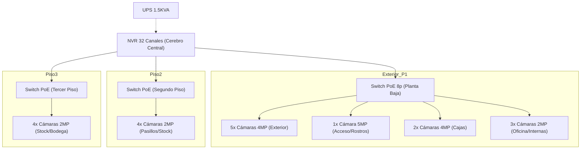

# 📄 Informe Técnico: Ferretería El Perro
**Fecha:** 17 de Marzo, 2026
**Cliente:** Ferretería El Perro (Lebu)
**Estado:** Cotización Enviada ($4.153.100 IVA Inc.)

---

## 🎯 Resumen Ejecutivo
Propuesta de seguridad avanzada para local comercial de 3 niveles, utilizando tecnología IP pura (NVR) y segmentación por pisos mediante switches PoE para una instalación limpia y escalable.

---

## 🛠️ Arquitectura de Dispositivos (Total: 19 Cámaras)

### Perímetro Exterior (5 puntos)
*   **Equipos:** 5 Cámaras de 4MP (Resolución QHD).
*   **Propósito:** Vigilancia perimetral disuasiva con alta capacidad de zoom digital para identificación de vehículos y peatones.

### Primer Piso (6 puntos - El Corazón del Local)
*   **Ingreso:** 1 Cámara de 5MP (Ultra Alta Resolución). Destinada exclusivamente a la **Detección de Rostros** mediante la IA del NVR.
*   **Cajas:** 2 Cámaras de 4MP. Enfoque crítico en transacciones de dinero.
*   **Oficina y Pasillos:** 3 Cámaras de 2MP. Supervisión operativa general.

### Segundo y Tercer Piso (8 puntos)
*   **Equipos:** 4 Cámaras de 2MP por nivel.
*   **Infraestructura:** Segmentación mediante **Switch PoE dedicado** por piso.
*   **Ventaja:** Salida desde el NVR con un solo cable UTP por piso, reduciendo el ductaje visible y mejorando la estética del local.

### Centralización e Infraestructura
*   **Gabinete:** Se instalará un **Rack de Pared (6U o 9U)** para centralizar el NVR y los switches PoE, protegiéndolos contra polvo y accesos no autorizados.

---

## 💎 Valor Agregado Estratégico

1.  **NVR de 32 Canales:** Se sobredimensiona la capacidad (solo se usan 19/32). Esto permite al cliente crecer un 60% en cámaras en el futuro sin cambiar el cerebro del sistema.
2.  **Infraestructura IP / NVR:** Transmisión de datos fluida, mayor bitrate y calidad de imagen superior a los sistemas analógicos (TVI/CVI).
3.  **Eficiencia en Instalación:** Uso de PoE Switch por nivel para centralizar datos, garantizando una instalación minimalista y estética.

---

## 🔍 Observaciones y Recomendaciones (Próximos Pasos)
Para asegurar la máxima robustez, el Agente de Negocio señala:

*   **🔒 Seguridad de Equipos:** La inclusión del Rack asegura la integridad física del NVR y la limpieza del cableado.
*   **⚠️ Respaldo Eléctrico (UPS):** El sistema de respaldo es **crítico** para la continuidad ante cortes de energía (evitando "puntos ciegos"). Se propone definir el modelo de UPS adecuado una vez finalizada la instalación física y evaluada la carga real, en caso de que no exista uno actualmente en el local.

---

## 🗺️ Mapa de Red Sugerido (Diagrama)

